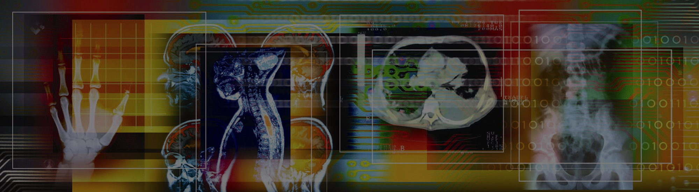

<p align="center">

</p>
<p align="center"> Resnet18 SkinCancer: A Deep Learning Model for Skin Cancer Detection </p>
<div align="center">
    <a href="[](https://huggingface.co/kadirnar)"></a>
    <a href="[](https://medium.com/@kadir.nar)"></a>

</div>

## 📚 Overview Resnet %99 Accuracy Skin Cancer Detection Model

SkinCancer is a deep learning model for skin cancer classification. Resnet18 is used as the base model. Resnet18 is a 18-layer deep neural network. The model is trained on 80% of the data and tested on 20% of the data. The model has an accuracy of %99.
## Installation
```bash
git clone https://github.com/kadirnar/SkinCancer-Classification
cd SkinCancer-Classification
pip install -r requirements.txt
```

## Usage
```python
python train.py
```

## References
- [Resnet18](https://arxiv.org/abs/1512.03385)